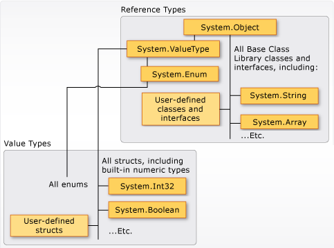

# Set up environment

[Microsoft tutorial](https://learn.microsoft.com/en-us/dotnet/csharp/tour-of-csharp/tutorials/local-environment)

# Basic Program Structure
## Top-level entry point
Một C# program sẽ chứa 1 hoặc nhiều files, mỗi file chứa 0 hoặc nhiều namespace. Mõi namespace chứa các type như: class, struct, interface, enumeration, delegate, hoặc các namespace khác
```c#
// A skeleton of a C# program
using System;

// Your program starts here:
Console.WriteLine("Hello world!");

namespace YourNamespace
{
    class YourClass{}
    struct YourStruct{}
    interface IYourInterface{}
    delegate int YourDelegate();
    enum YourEnum{}

    namespace YourNestedNamespace
    {
        struct YourStruct{}
    }
}
```
Ví dụ trên sử dụng **top-level statements** để đóng vai trò làm **program's entry point**. The program's entry point is the first line of program text in that file. Ta có thể tạo 1 method  **static void Main()** để đóng vai trò là program's entry point
```c#
class Program
{
    static void Main(string[] args)
    {
        //Your program starts here...
        Console.WriteLine("Hello world!");
    }
}
```
**Main method** là entry point của 1 C# application, khi app được khởi chạy, hàm Main sẽ được **invoke** đầu tiên. Mỗi C# program chỉ có thể có 1 entry point, nếu ta có nhiều hơn 1 class chứa **Main method**, ta sẽ cần compile program với **StartupObject compiler option** để chỉ định **Main method** nào sẽ là entry point.

Các entry-point được sử dụng trong Unity là **Awake()** và **Start()**
```c#
void Awake()
{
    // First entry point
    // Called once when script instance is loaded
    // Used for initializing variables or game state
}

void Start()
{
    // Second entry point
    // Called once before the first frame update
    // Used for initializing components that need other components to be ready
}
```

- Top-level statement được ngầm định thuộc **global namespace**

## Command-line arguments
Giống như Main method, top-level statement cũng có thể return values và truy cập vào các **command-line arguments**. Nếu chạy C# program với Rider, ta sẽ cần tùy chỉnh arguments ở phần: Edit Configurations -> tìm **Program arguments** field -> Nhập các arguments (ví dụ:g1, arg2,..) -> Nhấn apply và chạy program

```c#
using System.Text;

StringBuilder builder = new();
builder.AppendLine("The following arguments are passed:");
        
// Display the command line arguments using the args variable.
foreach (var arg in args)
    builder.AppendLine($"Argument={arg}");
        
Console.WriteLine(builder.ToString());
return 0;
```

**Ví dụ**: hiện ra các **command-line arguments** trong **Unity**. Mảng **args** sẽ gồm 13 phần tử, có nội dung đầy đủ như sau: `C:\Program Files\Unity\Hub\Editor\2022.3.24f1\Editor\Unity.exe -projectpath E:\..\<project_name> -useHub -hubIPC -cloudEnvironment production -licensingIpc LicenseClient-<client_name> -hubSessionId 15as311k-9127-0192-9102-nauq8193gr6e -accessToken nIj18uakLi091-ka90Iaj12nJi-01jdY7a-K9iamJ1h3y7s`
```c#
private void Start()
{
    string[] args = Environment.GetCommandLineArgs();
    string all_args = "";
    for (int i = 0; i < args.Length; i++)
    {
        Debug.Log($"args[{i}]: {args[i]}");
        all_args += $"{args[i]} ";
    }

    Debug.Log(all_args);
}
```

- **args array** không thể bị null -> có thể truy cập tới các property như **Length** mà không cần null-checking

## Overview 
- **Main method** là entry point của 1 executable program - where the program control starts and ends.
- **Main method** phải được *declared* trong 1 class hoặc struct. Enclosing class có thể là static.
- **Main method** phải là static
- **Main method** có thể có bất cứ **access modifier** (trừ *file*).
- **Main method** có thể có các kiểu trả về: void, int, Task, or Task<int>
```c#
static void Main() { }
static int Main() { }
static void Main(string[] args) { }
static int Main(string[] args) { }
static async Task Main() { }
static async Task<int> Main() { }
static async Task Main(string[] args) { }
static async Task<int> Main(string[] args) { }
```

The Main method can be declared with or without a string[] parameter that contains command-line arguments. When using Visual Studio to create Windows applications, you can add the parameter manually or else use the GetCommandLineArgs() method to obtain the command-line arguments. Parameters are read as zero-indexed command-line arguments. Unlike C and C++, the name of the program is not treated as the first command-line argument in the args array, but it is the first element of the GetCommandLineArgs() method.

# Type System
Mỗi type sẽ gồm các thông tin:
- Không gian bộ nhớ mà variable thuộc type đó sẽ chiếm
- Giá trị min và max và type đó có thể biểu diễn
- Các member (methods, fields, events,..) mà type đó chứa
- Các interface mà nó implement
- Các operation được phép thực hiện trên type đó
- Base type mà type đó inherit


`Trong C#, bool không thể chuyển đổi thành int`  
Compiler sẽ dùng **type information** để đảm bảo các thao tác thực hiện trên type đó trong code là đúng (*type safe*)
Compiler nhúng (embed) **type information** vào *executable file* dưới dạng **metadata**. **Common Language Runtime (CLR)** dựa vào các **metadata** đó để đảm bảo *type safe* hơn nữa khi **allocate memory** và **reclaim memory**

Khi một value được gán cho 1 **new variable** hoặc được truyền dưới dạng **method argument**, một **type conversion** mà không làm mất data sẽ được thực hiện tự động bởi compiler. Một **type conversion** mà có khả năng làm mất dâ sẽ cần 1 **cast** trong source code

## Built-in type
Built-in value types:
- bool, byte, sbyte, char, decimal, double, float, int, unit,..
- Những type được user define bằng struct

Built-in reference types: 
- object, dynamic, string
- Những type được user define bằng class và record

Value types và reference type có **compile-time rule** và **run-time behaviour** khác nhau 

<table>
    <tr>
        <td></td>
    </tr>
    <tr>
        <th>Relationship between value types and reference types in the Common Type System (CTS)</th>
    </tr>
</table>

## Custom type
Ta có thể dùng các constructs: **struct, class, interface, enum, và record**   
Một số practice use cases dựa trên mong muốn với type:
- Nếu data storage size <= 64 bytes -> chọn struct hoặc record struct. 
- Nếu type mong muốn là immutable (không thể  thay đổi), hoặc nondestructive mutation -> chọn struct hoặc record struct.
- Nếu type mong muốn nên có **value semantics for equality** (ta muốn 2 instances của type này được coi là **bằng nhau** nếu chúng có cùng data, thay vì trỏ tới cùng vùng nhớ trên memory) -> chọn record class hoặc record struct. 
- Nếu type mong muốn chỉ có mục đích chính là lưu data, thay vì behavior -> chọn record class hoặc record struct. 
- Nếu type mong muốn là 1 phần của 1 **inheritance hierarchy** -> chọn record class hoặc class. 
- Nếu type mong muốn có sử dụng **polymorphism** -> chọn class. 
- Nếu type mong muốn có mục đích chính là chứa các behaviour -> chọn class.

## Common Type system
```c#
// 1. Create a Person object:
Person person1 = new Person("Alice", 30);
//person1: Name = Alice, Age = 30

// 2. Assign person1 to person2:
Person person2 = person1; // This does NOT create a new Person object!
// erson2: Name = Alice, Age = 30

// 3. Modify person2:
person2.name = "Bob";
//person1: Name = Bob, Age = 30
//person2: Name = Bob, Age = 30

public class Person
{
    public string name;
    public int age;
    public Person(string n, int a)
    {
        name = n;
        age = a;
    }
}
```
Class là **reference type**  
Khi chạy `Person person1 = new Person("Alice", 30);`, variable `perrson1` không chứa bản thân cái object vừa được tạo ra, mà nó chứa 1 reference (1 memory address) tới vùng nhớ lưu `object` đó. 

```c#
// 1. Create a Person object:
Person person1 = new Person("Alice", 30);
//person1: Name = Alice, Age = 30

// 2. Assign person1 to person2:
Person person2 = person1; // This does NOT create a new Person object!
// erson2: Name = Alice, Age = 30

// 3. Modify person2:
person2.name = "Bob";
//person1: Name = Alice, Age = 30
//person2: Name = Bob, Age = 30

public struct Person
{
    public string name;
    public int age;
    public Person(string n, int a)
    {
        name = n;
        age = a;
    }
}
```
Struct là value type. Khi tạo variable `person1`, `person1` sẽ chứa data, và khi gán `Person person2 = person1;`, `person2` sẽ copy data từ `person1` -> Chúng không trỏ cùng tới 1 vùng nhớ trên memory

Record types can be either reference types (record class) or value types (record struct). Record types contain methods that support value-equality.

In general, classes are used to model more complex behavior. Classes typically store data that is intended to be modified after a class object is created. Structs are best suited for small data structures. Structs typically store data that isn't intended to be modified after the struct is created. Record types are data structures with additional compiler synthesized members. Records typically store data that isn't intended to be modified after the object is created.

## Value types
Value types derive (dẫn xuất) từ `System.ValueType` (derives từ System.Object). Value types chứa trực tiếp giá trị của chúng,

https://learn.microsoft.com/en-us/dotnet/csharp/fundamentals/types/